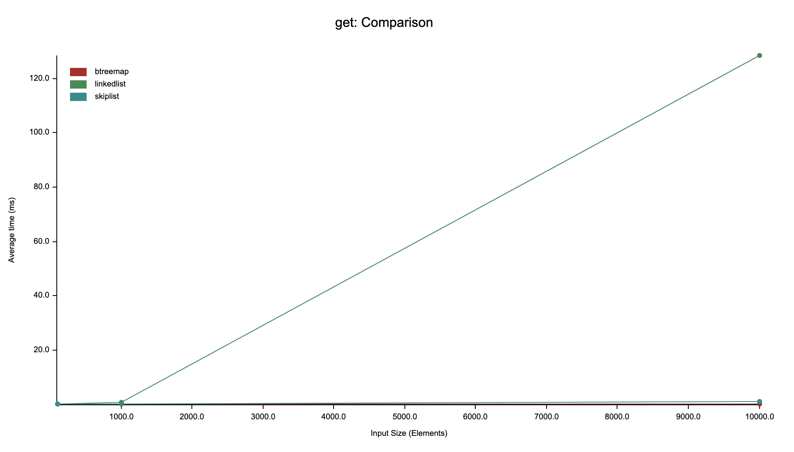

# Rust 数据结构 - 跳表

跳表是一个基于链表的有序数据结构, 它允许快速查找和插入, 对于插入, 查找和删除的时间复杂度都是 `O(log N)`, 并且在插入和删除后都保持有序. Redis 的 `SortedSet` 数据类型底层就是使用的跳表.

# 跳表的结构

跳表是将"以空间换时间"诠释到极致的优雅数据结构. 让我们想一下传统的有序链表的问题:

```
HEAD -> (-10) -> (1) -> (2) -> (3) -> (10) -> TAIL
```

此时如果要插入一个 key 为 5 的节点, 那么我们就需要将 5 插入到 3 和 10 之间, 但是这样插入的复杂度是 `O(N)`, 因为我们需要通过遍历找到插入的位置. 查找, 删除操作同理.

这一切的原因都是因为遍历的时候只能一个节点一个节点地遍历, 因为一个节点只有一个 `next` 指针. 而跳表, 顾名思义, 可以跳着访问. 跳表的一个节点有有多层指针, 被存在 `forward` 数组中, 越高层的指针跳得越远, 而最底层的指针永远指向真正的下一个节点.

可能从定义上不太好理解, 但是跳表这个结构看一下图就很容易理解了:

```
L3 |HEAD -> (-10: -10)---------- -> (2: 2)---------------------- -> TAIL
   |(1)     (2)                     (3)
   ||       |                       |                               |
L2 |HEAD -> (-10: -10) -> (1: 1) -> (2: 2)---------------------- -> TAIL
   |(1)     (1)           (1)       (3)
   ||       |             |         |                               |
L1 |HEAD -> (-10: -10) -> (1: 1) -> (2: 2)---------- -> (10: 10) -> TAIL
   |(1)     (1)           (1)       (2)                 (1)
   ||       |             |         |                   |           |
L0 |HEAD -> (-10: -10) -> (1: 1) -> (2: 2) -> (3: 3) -> (10: 10) -> TAIL
   |(1)     (1)           (1)       (1)       (1)       (1)
```

其中 (-10: -10) 代表 key 和 value, 下面的 (2) 代表这层指针会跳到后面的第 2 个节点, 也就是说中间跳过了 1 个节点.

虽然跳表画出来是一个矩阵, 但其实本质上依然是一个线性的链表. 也就是说, 实际上整个跳表也就是 n 个真实节点 + 两个可选的 head, tail 哨兵节点, 只是每个节点的指针不是一个, 而是多个. 高层指针跳得更远, 底层指针跳得更近.

跳表的所有遍历都是从左上角, 也就是从"第 `self.level` 层的 `head` 节点开始", 先向右跳, 然后向下降级. 以查找 10 为例:

1. 初始化为 head 节点, 在第 3 层
2. 向右跳到 -10 节点
3. 向右跳到 2 节点
4. 发现此时本层的下一个节点是 tail, 于是向下降级到第 2 层
5. 发现第 2 层下一个节点依然是 tail, 于是向下降级到第 1 层
6. 下一个节点是 10, 查找结束

由于跳表的降级几乎无性能开销(只需要执行一次类似 current_level -= 1 的计算), 所以可以先忽略. 上面的查询操作一共访问了不含 head 的 3 个节点, 也就是说访问 3 次就找到了 -10 这个节点. 如果直接从第 0 层, 也就是链表的形态来访问, 需要访问 5 次. 因此跳表的查询性能比链表要好.

# 随机性

不像 AVL, 红黑树等严格平衡的有序结构, 跳表的有序性是随机的, 因为每个节点的 `level` 是随机生成的. 理想情况下, 越高层的节点应该越少, 因为这样在高层才能跳过更多的节点.

一般最简单的生成每个新节点的 `level` 方法是:

```rust
fn random_level() -> i32 {
  let mut level = 0;

  while rand::random::<f64>() < 0.5 && level < MAX_LEVEL {
    level += 1;
  }

  level
}
```

也就是说一个节点的 `level` 每次有 50% 的概率增加 1，直到最大高度。那么 `level = 1` 的概率是 50%， `level = 2` 的概率是 25%， `level = 3` 的概率是 12.5%， `level = 4` 的概率是 6.25%...

`MAX_LEVEL` 的值是跳表自身的属性, 一般为 16 或者 32, 代表最高层高, 不代表最多容纳的元素数量, 因为就算达到了最高层高也可以无限向后面插入元素, 只是性能优化就不明显了.

由于随机性, 跳表的结构是不确定的. 对于完全相同的插入操作, 最终生成的跳表结构极大可能会不同. 虽然有随机性, 但是按照我们的 `rand_level` 方法, 数学期望上每一层节点都是下一层的 1/2, 所以每下降一层都会排除掉一半的节点, 和二叉搜索树的过程类似, 所以平均下来的时间复杂度是 `O(log N)`.

# 随机访问优化

上面的跳表有一个问题, 没法快速访问第 n 个元素, 还得从第 0 层也就是链表的结构访问. 但这个问题很好解决, 我们给每个 `forward` 数组里的指针加一个 `span` 值, 表示该指针跳过的节点数量(包含目标节点), 这样就可以在遍历时同时累加已经跳过的总节点数, 当总节点数等于 n 时, 就返回当前指针. 如果马上要跳过了, 就下降一层. 因为第 0 层每个指针的 `span` 一定是 1, 所以我们必定能找到第 n 个元素, 只要 n < 总节点数.

# 数据结构

````rust
pub trait Key: Ord {} // Key 必须实现 Ord
impl<T> Key for T where T: Ord {}

pub trait Value {}
impl<T> Value for T {}

pub struct Node<K, V> {
    key: MaybeUninit<K>,
    value: MaybeUninit<V>,
    forward: Vec<ForwardPtr<K, V>>,
    level: usize,
}

impl<K: Key, V: Value> Node<K, V> {
    pub fn key(&self) -> &K {
        unsafe { self.key.assume_init_ref() }
    }

    pub fn key_mut(&mut self) -> &mut K {
        unsafe { self.key.assume_init_mut() }
    }

    pub fn value(&self) -> &V {
        unsafe { self.value.assume_init_ref() }
    }

    pub fn value_mut(&mut self) -> &mut V {
        unsafe { self.value.assume_init_mut() }
    }
}

type NodePtr<K, V> = NonNull<Node<K, V>>;

#[derive(Debug)]
struct ForwardPtr<K, V> {
    ptr: NodePtr<K, V>,
    span: usize, // forward_ptr 携带 span 信息
}

// 这里必须手动实现 Clone, 不能使用 derive
// 因为 #[derive(Clone)] 生成的代码类似:
// ```rust
// impl<K: Clone, V: Clone> Clone for ForwardPtr<K, V>
// ```
// 要求望 K, V 都必须实现 Clone, 但其实我们不能限制 K, V 必须都实现 Clone.
impl<K, V> Clone for ForwardPtr<K, V> {
    fn clone(&self) -> Self {
        Self {
            ptr: self.ptr,
            span: self.span,
        }
    }
}

impl<K, V> Copy for ForwardPtr<K, V> {}

impl<K, V> PartialEq for ForwardPtr<K, V> {
    fn eq(&self, other: &Self) -> bool {
        self.ptr == other.ptr
    }
}

impl<K, V> Default for ForwardPtr<K, V> {
    fn default() -> Self {
        Self {
            ptr: NonNull::dangling(),
            span: 0,
        }
    }
}

#[derive(Debug)]
pub struct SkipList<K: Key, V: Value> {
    head: NodePtr<K, V>,
    tail: NodePtr<K, V>,
    level: usize, // 跳表的 level 等于当前最高的那个节点的 level
    len: usize,
}

const MAX_LEVEL: usize = 32;
````

和[红黑树](https://github.com/arichy/blogs/blob/main/docs%2FRust%2Fdatastructures%2Fred-black-tree%2Fzh%2FRust%E6%95%B0%E6%8D%AE%E7%BB%93%E6%9E%84-%E7%BA%A2%E9%BB%91%E6%A0%91.md#6-rust-%E8%AF%AD%E8%A8%80%E7%89%B9%E6%80%A7%E7%9B%B8%E5%85%B3%E9%97%AE%E9%A2%98)类似, 由于哨兵节点 `head` 和 `tail` 的 `key`, `value` 都不能携带值, 所以需要用 `MaybeUninit`. 和红黑树不一样的是, 跳表的 `IntoIter` 由于可以在每次遍历后都释放节点, 不像红黑树那样需要保留树的结构来找到后继节点, 所以对 `key` 和 `value` 不需要使用 `ManuallyDrop`.

# 插入

跳表的插入/删除逻辑相比红黑树简单太多了, 核心都是从高层往底层遍历, 维护一个 `update` 数组, 每遍历完第 i 层就把当前层的节点指针放到 `update[i]` 中. 遍历完成后, 再次从高层往底层遍历 `update` 数组. 对于插入而言, 就在 `update[i]` 对应的这个节点的第 i 层插入新节点.

```rust
pub fn insert(&mut self, key: K, value: V) -> Option<V> {
    let level = Self::rand_level(); // 随机生成 level

    // 如果 level 大于跳表的 level，则更新跳表自己的 level, 并且让 head 的新增的层的指针都先指向 tail
    if level > self.level {
        for _ in (self.level + 1)..=level {
            unsafe {
                self.head.as_mut().forward.push(ForwardPtr {
                    ptr: self.tail,
                    span: self.len + 1,
                });
            }
        }
        self.level = level;
    }

    // update[i] 存的是第 i 层需要更新的节点指针, 指向的是第 i 层最后一个小于 key 的节点
    let mut update = vec![NodePtr::dangling(); self.level + 1];
    let mut steps = vec![0; self.level + 1];
    let mut step = 0;

    let mut cur = self.head;
    for i in (0..=self.level).rev() {
        loop {
            let cur_node_ref = unsafe { cur.as_ref() };
            let next = cur_node_ref.forward[i].ptr;

            if self.is_tail(next) {
                break;
            }
            let next_key = (unsafe { next.as_ref() }).key();

            // 如果节点的 key 小于当前 key，则继续
            if next_key < &key {
                step += cur_node_ref.forward[i].span;
                cur = next;
            } else {
                break;
            }
        }
        update[i] = cur;
        steps[i] = step;
    }

    let mut next = unsafe { cur.as_ref() }.forward[0].ptr;

    if !self.is_tail(next) && unsafe { next.as_ref() }.key() == &key {
        // 如果 key 已经存在了, 则更新 value 并且返回 old value
        let old_v = std::mem::replace(unsafe { next.as_mut() }.value_mut(), value);

        return Some(old_v);
    }

    cur = next;

    step += 1;

    let mut forward = vec![ForwardPtr::default(); level + 1];

    let new_node = Box::new(Node {
        key: MaybeUninit::new(key),
        value: MaybeUninit::new(value),
        forward: vec![],
        level,
    });

    let mut new_node_ptr = NonNull::from(Box::leak(new_node));

    // 更新每个 update[i]
    // new_node.forward[i] = update[i].forward[i]
    // update[i].forward[i] = new_node
    for i in (0..=self.level).rev() {
        let update_node = unsafe { update[i].as_mut() };
        if i <= level {
            let cur_span = step - steps[i];

            forward[i] = ForwardPtr {
                ptr: update_node.forward[i].ptr,
                span: steps[i] + update_node.forward[i].span - step + 1,
            };

            update_node.forward[i].ptr = new_node_ptr;
            update_node.forward[i].span = cur_span;
        } else {
            // 更新新节点上面的 update[i] 的指针 span, 因为多插入了一个节点
            update_node.forward[i].span += 1;
        }
    }

    unsafe { new_node_ptr.as_mut() }.forward = forward;

    self.len += 1;
    None
}
```

# 删除

删除和插入类似, 细微的区别在于如果没找到要删除的节点就返回 None, 整体逻辑也是从左上角开始遍历, 找到每一层的 `update[i]`, 然后逐层执行链表的删除.注意 `update[i]` 并不是要删除的节点, 而是要删除的节点在每一层的前驱结点. 伪代码:

```rust
update[i].forward[i] = update[i].forward[i].forward[i];
drop(node_to_remove); // node_to_remove 会在遍历中找到
```

# 查找

查找也类似, 从左上角开始遍历, 不过多赘述.

# 内存管理

由于我们使用的裸指针, 需要手动释放内存

```rust
impl<K: Key, V: Value> Drop for SkipList<K, V> {
    fn drop(&mut self) {
        unsafe {
            let mut cur = self.head.as_ref().forward[0].ptr;

            while !self.is_tail(cur) {
                let next = cur.as_ref().forward[0].ptr;
                let _ = Box::from_raw(cur.as_ptr());
                cur = next;
            }

            let _ = Box::from_raw(self.head.as_ptr());
            let _ = Box::from_raw(self.tail.as_ptr());
        }
    }
}
```

# 性能对比

这是跳表, 链表, BTreeMap 的查找性能对比:



可以看到在元素数量变多时, 链表性能急剧恶化, 而跳表和 BTreeMap 的性能基本不变, 再次证明了跳表总体的查找时间复杂度是 `O(log N)`.

# 总结

同为时间复杂度 `O(log N)` 的有序结构, 跳表相比红黑树实现起来简单太多了. 在两者都熟悉的情况下, 红黑树光是二叉搜索树自身的插入/删除/旋转操作都能写一天, 但是整个跳表半天就可以写完. 并且跳表极致的以空间换时间的思想, 使其成为了一个非常优雅的数据结构.

# 完整代码

https://github.com/Arichy/skip-list-rs
